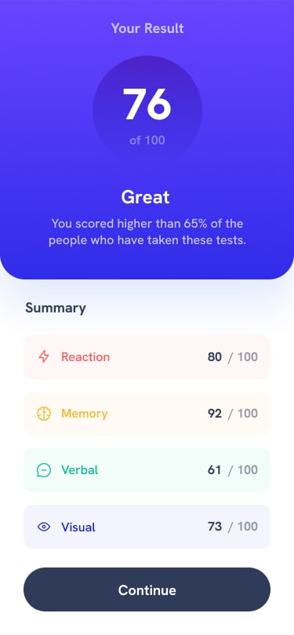

# 📊 Results Summary

Responsive **Results Summary component** built with HTML, CSS, and JavaScript.  
This project is a solution to the [Frontend Mentor](https://www.frontendmentor.io?ref=challenge) challenge, designed to present performance scores with a clean and accessible layout.

---

## 🔗 Live Demo
[**View Live Project**](https://kontractour.github.io/result-summary/)

### 📱 Mobile View  
  

### 💻 Desktop View  
  

---

## 📌 Features
- Responsive layout optimized for mobile and desktop screens.
- Dynamic score rendering from an external `data.json` file.
- Accessible color contrast and semantic HTML.
- Category-based score sections with individual styling.
- Smooth number animation for score values.

---

## 🛠 Technologies Used
- **HTML5** – Semantic structure and accessibility.
- **CSS3** – Flexbox, gradients, and responsive styles.
- **JavaScript (ES6+)** – DOM manipulation, animations, and data fetching.
- **JSON** – External data storage for scores.

---

## 📂 Project Structure

```
📁 results-summary
│── 📁 assets
│ ├── 📁 fonts # Custom font files
│ └── 📁 images # Icons for categories
│
│── 📁 design
│ ├── active-states.jpg # Active state design
│ ├── desktop-design.jpg # Desktop layout reference
│ └── mobile-design.jpg # Mobile layout reference
│
│── .gitignore
│── data.json
│── index.html
│── preview.jpg
│── README-template.md
│── README.md
│── script.js
│── style-guide.md
│── style.css

```
---

## 🚀 Getting Started

**1. Clone the repository**
```bash
git clone https://github.com/kontractour/results-summary.git
```
---
**2. Open the project**

Open index.html in your browser.

---
🤝 Support & Contribution
---

If you find this project useful:

⭐ Star the repository to show support.

🍴 Fork it to adapt or improve.

🛠 Contribute by opening issues or pull requests.

---

📜 Attribution
---
Challenge by Frontend Mentor
Coded by [Kontractour](https://github.com/Kontractour)